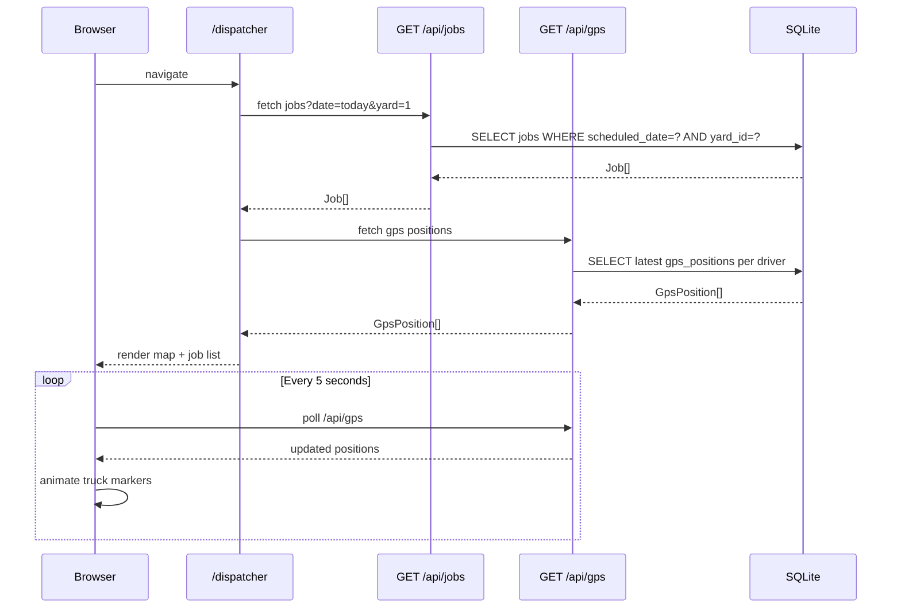
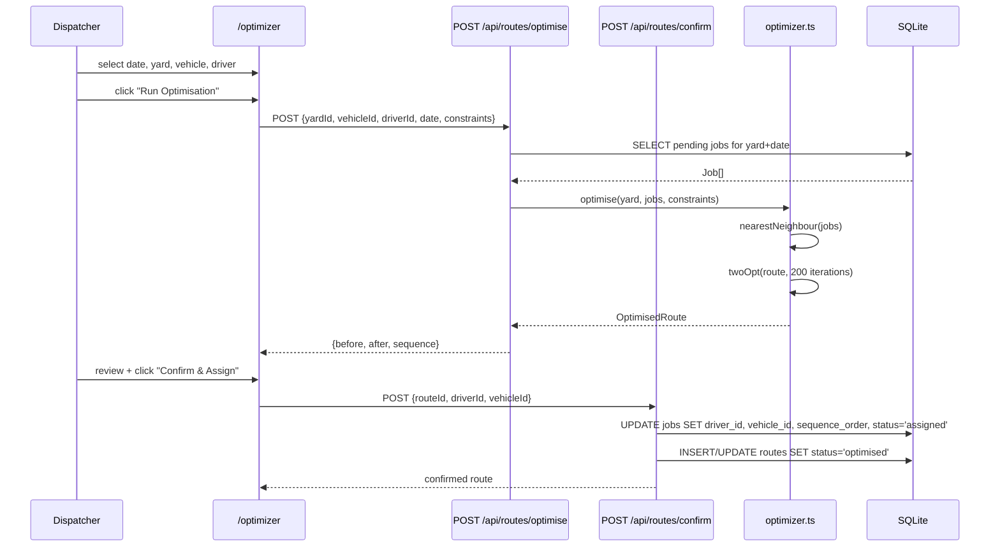
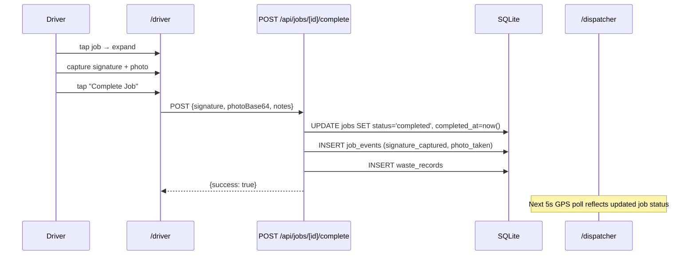

# Design Document: Waste Route Optimisation Platform

## Overview

A fully functional Next.js 14+ (App Router) prototype demonstrating two commercial options side-by-side for a waste management client: **Option 1** (Route Optimisation Layer — sits on top of an existing system) and **Option 3** (Full Platform Replacement — complete enterprise solution). The platform uses a single SQLite database, a custom route optimisation algorithm, simulated GPS telemetry, and a responsive UI built with Tailwind CSS and shadcn/ui. All data persists locally; no paid external APIs are required.

The prototype is structured so that a single option-toggle pill in the sidebar instantly locks or unlocks Option 3-only modules, making the feature delta immediately visible to the client during a live demo. The default view on load is Option 3 (full platform).

## Architecture

```mermaid
graph TD
    subgraph Browser
        UI[Next.js App Router Pages]
        SidebarNav[Sidebar + Option Toggle]
        MapLayer[Leaflet Map Components]
        GPSPoll[GPS Poll setInterval 5s]
    end

    subgraph API["Next.js API Routes /api/*"]
        JobsAPI[/api/jobs]
        RoutesAPI[/api/routes + /optimise + /confirm]
        DriversAPI[/api/drivers]
        VehiclesAPI[/api/vehicles]
        YardsAPI[/api/yards]
        GPSAPI[/api/gps]
        ReportsAPI[/api/reports/*]
        CustomersAPI[/api/customers]
        BookingsAPI[/api/bookings]
        InvoicesAPI[/api/invoices]
        ComplianceAPI[/api/compliance]
        TelematicsAPI[/api/telematics]
    end

    subgraph Lib["Server-Side Libraries /lib/*"]
        DB[db.ts — SQLite via better-sqlite3]
        Seed[seed.ts — One-time seed runner]
        Optimizer[optimizer.ts — NN + 2-opt algorithm]
        GPSSim[gps-simulator.ts — Interpolated waypoints]
    end

    UI -->|fetch| API
    GPSPoll -->|GET /api/gps| GPSAPI
    API --> Lib
    Seed --> DB
    Optimizer --> DB
    GPSSim --> DB
```

## Sequence Diagrams

### Dispatcher Dashboard Load



### Route Optimisation Flow



### Driver Job Completion Flow



## Components and Interfaces

### Component: AppShell (Layout)

**Purpose**: Root layout providing sidebar navigation, top navbar, and option toggle state via React context.

**Interface**:
```typescript
interface OptionContextValue {
  option: 'option1' | 'option3'
  setOption: (o: 'option1' | 'option3') => void
}

interface NavItem {
  label: string
  href: string
  icon: LucideIcon
  option3Only: boolean
}
```

**Responsibilities**:
- Render collapsible sidebar with nav items
- Provide `OptionContext` to all child pages
- Lock/grey Option 3-only items when `option === 'option1'`
- Show tooltip "Available in Option 3 – Full Platform" on locked items
- Render top navbar with breadcrumbs, live clock, yard filter, notifications

### Component: DispatcherMap

**Purpose**: Full-height Leaflet map showing yard markers, job pins, driver truck icons, and route polylines.

**Interface**:
```typescript
interface DispatcherMapProps {
  jobs: Job[]
  gpsPositions: GpsPosition[]
  routes: Route[]
  yards: Yard[]
  selectedYard: number | null
  onJobPinClick: (job: Job) => void
}
```

**Responsibilities**:
- Render yard markers (warehouse icon)
- Render job pins coloured by status (pending=grey, assigned=blue, in_progress=orange, completed=green)
- Render animated truck icons at GPS positions, interpolating movement
- Render route polylines per active route
- Show job popup with customer name, address, skip size, status, action buttons

### Component: JobList

**Purpose**: Left-panel scrollable job list with tabs and drag-and-drop reordering.

**Interface**:
```typescript
interface JobListProps {
  jobs: Job[]
  onReorder: (reorderedJobs: Job[]) => void
  onOptimiseAll: () => void
  selectedDate: string
  selectedYard: number | null
  onDateChange: (date: string) => void
  onYardChange: (yardId: number | null) => void
}
```

**Responsibilities**:
- Render stats strip (Total / Pending / In Progress / Completed / Unassigned)
- Render tabs: All / Pending / In Progress / Completed
- Render draggable job cards via @dnd-kit/sortable
- Trigger route optimisation modal

### Component: RouteOptimizerPanel

**Purpose**: Controls and results display for the route optimisation engine.

**Interface**:
```typescript
interface OptimisationRequest {
  yardId: number
  vehicleId: number
  driverId: number
  date: string
  constraints: {
    maxStops: number
    shiftEndTime: string
    avoidMotorways: boolean
    prioritiseCommercial: boolean
  }
}

interface OptimisationResult {
  routeId: number
  before: RouteStats
  after: RouteStats
  sequence: JobSequenceItem[]
  improvement: number // percentage
}

interface RouteStats {
  totalDistanceKm: number
  estimatedDurationMins: number
  stopCount: number
}

interface JobSequenceItem {
  order: number
  job: Job
  estimatedArrival: string
  distanceFromPrevKm: number
}
```

### Component: DriverMobileView

**Purpose**: 390px phone-frame responsive web app for drivers.

**Interface**:
```typescript
interface DriverViewProps {
  driverId: number
}

type DriverTab = 'home' | 'jobs' | 'map' | 'profile'
```

**Responsibilities**:
- Render phone frame container (max-w-[390px])
- Bottom tab bar navigation
- Shift toggle (on/off duty)
- Job completion flow: signature pad → photo capture → confirm
- Route map with pulsing position dot

### Component: CustomerPortal

**Purpose**: Visually distinct lighter-palette portal for end customers.

**Interface**:
```typescript
interface BookingFormState {
  step: 1 | 2 | 3 | 4
  jobType: JobType | null
  skipSize: number | null
  address: string
  lat: number | null
  lng: number | null
  preferredDate: string
  preferredSlot: string
  notes: string
}
```

**Responsibilities**:
- Multi-step booking form (job type → skip size → address/date → confirm)
- My Orders history view
- Invoice list with mock "Pay Now" button

## Data Models

### Core Types

```typescript
type JobType = 'delivery' | 'collection' | 'exchange' | 'wait_and_load'
type JobStatus = 'pending' | 'assigned' | 'in_progress' | 'completed' | 'cancelled'
type VehicleType = 'skip_lorry' | 'flatbed' | 'tipper'
type VehicleStatus = 'available' | 'on_route' | 'maintenance'
type DriverStatus = 'available' | 'on_shift' | 'off_duty'
type BookingStatus = 'pending' | 'confirmed' | 'scheduled' | 'completed' | 'cancelled'
type InvoiceStatus = 'draft' | 'sent' | 'paid' | 'overdue'
type RouteStatus = 'draft' | 'optimised' | 'active' | 'completed'
type TelematicsEventType = 'harsh_brake' | 'speeding' | 'idle_excess' | 'geofence_exit' | 'low_fuel'

interface Yard {
  id: number
  name: string
  address: string
  lat: number
  lng: number
  serviceRadiusKm: number
  skipStock: Record<string, number>
  createdAt: string
}

interface Vehicle {
  id: number
  yardId: number
  registration: string
  type: VehicleType
  capacityTonnes: number
  maxSkips: number
  status: VehicleStatus
  telematicsId: string | null
}

interface Driver {
  id: number
  yardId: number
  name: string
  phone: string
  licenceClass: string
  shiftStart: string
  shiftEnd: string
  status: DriverStatus
}

interface Job {
  id: number
  bookingId: number | null
  yardId: number
  driverId: number | null
  vehicleId: number | null
  type: JobType
  status: JobStatus
  customerName: string
  customerPhone: string
  address: string
  lat: number
  lng: number
  skipSize: number
  notes: string | null
  scheduledDate: string
  scheduledTime: string | null
  completedAt: string | null
  sequenceOrder: number
  routeId: number | null
}

interface Route {
  id: number
  yardId: number
  date: string
  driverId: number | null
  vehicleId: number | null
  status: RouteStatus
  jobIds: number[]
  totalDistanceKm: number
  estimatedDurationMins: number
  optimisedAt: string | null
}

interface GpsPosition {
  id: number
  driverId: number
  vehicleId: number
  lat: number
  lng: number
  speedKmh: number
  heading: number
  fuelLevel: number
  engineStatus: 'on' | 'off'
  timestamp: string
}

interface WasteRecord {
  id: number
  jobId: number
  vehicleId: number
  wasteType: string
  weightKg: number
  disposalSite: string
  carrierId: string | null
  consignmentNote: string | null
  transferNoteNumber: string | null
  createdAt: string
}

interface TelematicsEvent {
  id: number
  vehicleId: number
  driverId: number
  eventType: TelematicsEventType
  lat: number
  lng: number
  speedKmh: number
  timestamp: string
  details: Record<string, unknown>
}
```

**Validation Rules**:
- `skipSize` must be one of: 2, 4, 6, 8, 10, 12, 14, 16
- `lat` must be in range [-90, 90]; `lng` in range [-180, 180]
- `scheduledDate` must be ISO date string (YYYY-MM-DD)
- `sequenceOrder` must be >= 0; 0 means unassigned
- Route `jobIds` must reference existing job IDs in the same yard

## Algorithmic Pseudocode

### Route Optimisation: Nearest-Neighbour + 2-opt

```typescript
// lib/optimizer.ts

interface OptimiserInput {
  yard: Yard
  jobs: Job[]
  constraints: OptimisationConstraints
}

interface OptimisationConstraints {
  maxStops: number
  shiftEndTime: string
  avoidMotorways: boolean
  prioritiseCommercial: boolean
}
```

```pascal
ALGORITHM optimise(yard, jobs, constraints)
INPUT:  yard: Yard, jobs: Job[], constraints: OptimisationConstraints
OUTPUT: OptimisationResult

PRECONDITIONS:
  - jobs.length >= 1
  - All jobs have valid lat/lng coordinates
  - yard has valid lat/lng

BEGIN
  // Phase 1: Nearest-Neighbour construction heuristic
  unvisited ← copy(jobs)
  route ← []
  current ← yard  // start from yard

  WHILE unvisited is not empty DO
    nearest ← argmin over j in unvisited of haversine(current, j)
    route.append(nearest)
    unvisited.remove(nearest)
    current ← nearest
  END WHILE

  // Phase 2: 2-opt improvement
  improved ← true
  iterations ← 0

  WHILE improved AND iterations < 200 DO
    improved ← false
    FOR i FROM 0 TO route.length - 2 DO
      FOR k FROM i+1 TO route.length - 1 DO
        delta ← twoOptDelta(route, i, k, yard)
        IF delta < -0.001 THEN  // improvement found
          route ← twoOptSwap(route, i, k)
          improved ← true
        END IF
      END FOR
    END FOR
    iterations ← iterations + 1
  END WHILE

  // Phase 3: Compute stats and arrival times
  totalDist ← 0
  currentTime ← shiftStartTime
  sequence ← []

  prev ← yard
  FOR order, job IN enumerate(route) DO
    dist ← haversine(prev, job)
    travelMins ← (dist / AVG_SPEED_KMH) * 60
    serviceMins ← estimateServiceTime(job.type)
    arrival ← currentTime + travelMins
    sequence.append({order, job, estimatedArrival: arrival, distanceFromPrevKm: dist})
    totalDist ← totalDist + dist
    currentTime ← arrival + serviceMins
    prev ← job
  END FOR

  // Add return to yard
  totalDist ← totalDist + haversine(prev, yard)

  RETURN {
    sequence,
    totalDistanceKm: totalDist,
    estimatedDurationMins: (currentTime - shiftStartTime)
  }
END

ALGORITHM twoOptSwap(route, i, k)
INPUT:  route: Job[], i: number, k: number
OUTPUT: Job[]

PRECONDITIONS:
  - 0 <= i < k < route.length

BEGIN
  newRoute ← route[0..i-1] + reverse(route[i..k]) + route[k+1..]
  RETURN newRoute
END

POSTCONDITIONS:
  - newRoute.length === route.length
  - newRoute contains same jobs as route (permutation)

ALGORITHM haversine(a, b)
INPUT:  a: {lat, lng}, b: {lat, lng}
OUTPUT: distanceKm: number

BEGIN
  R ← 6371  // Earth radius km
  dLat ← toRad(b.lat - a.lat)
  dLng ← toRad(b.lng - a.lng)
  h ← sin(dLat/2)^2 + cos(toRad(a.lat)) * cos(toRad(b.lat)) * sin(dLng/2)^2
  RETURN 2 * R * arcsin(sqrt(h))
END
```

**Loop Invariants (2-opt outer loop)**:
- At the start of each iteration, `route` is a valid permutation of all input jobs
- `totalDistance(route)` is non-increasing across iterations
- After 200 iterations or when `improved = false`, the route is locally 2-optimal

### GPS Simulator

```pascal
ALGORITHM simulateGpsMovement(driverId, vehicleId, waypoints)
INPUT:  driverId: number, vehicleId: number, waypoints: LatLng[]
OUTPUT: void (writes to DB every 5 seconds via setInterval)

PRECONDITIONS:
  - waypoints.length >= 2
  - All waypoints have valid lat/lng

BEGIN
  segmentIndex ← 0
  progress ← 0.0  // 0.0 to 1.0 within current segment

  ON INTERVAL every 5000ms DO
    IF segmentIndex >= waypoints.length - 1 THEN
      segmentIndex ← 0  // loop back to yard
      progress ← 0.0
    END IF

    from ← waypoints[segmentIndex]
    to ← waypoints[segmentIndex + 1]

    // Interpolate position
    lat ← from.lat + (to.lat - from.lat) * progress
    lng ← from.lng + (to.lng - from.lng) * progress
    heading ← bearing(from, to)
    speed ← randomBetween(25, 50)  // km/h

    INSERT INTO gps_positions (driverId, vehicleId, lat, lng, speed, heading, ...)

    progress ← progress + 0.15
    IF progress >= 1.0 THEN
      segmentIndex ← segmentIndex + 1
      progress ← 0.0
    END IF
  END INTERVAL
END
```

## Key Functions with Formal Specifications

### `GET /api/jobs`

```typescript
// Query params: date?, yardId?, status?, driverId?
function getJobs(params: JobQueryParams): Job[]
```

**Preconditions**:
- `date` if provided is a valid ISO date string
- `yardId` if provided references an existing yard

**Postconditions**:
- Returns array of jobs matching all provided filters
- Empty array (not null) when no matches
- Results ordered by `sequence_order ASC, scheduled_time ASC`

### `POST /api/routes/optimise`

```typescript
function optimiseRoute(req: OptimisationRequest): OptimisationResult
```

**Preconditions**:
- `yardId` references an existing yard
- `date` is a valid ISO date string
- At least 1 pending job exists for the yard on that date

**Postconditions**:
- Returns `OptimisationResult` with `improvement >= 0`
- `after.totalDistanceKm <= before.totalDistanceKm`
- Typical improvement: 15–30% distance reduction
- Does NOT persist to DB until `POST /api/routes/confirm` is called

### `POST /api/jobs/[id]/complete`

```typescript
function completeJob(id: number, payload: JobCompletePayload): { success: boolean }

interface JobCompletePayload {
  signature: string       // base64 data URL
  photoBase64?: string    // optional photo
  notes?: string
  wasteType?: string
  weightKg?: number
  disposalSite?: string
}
```

**Preconditions**:
- Job with `id` exists and has `status === 'in_progress'`
- `signature` is a non-empty base64 string

**Postconditions**:
- `jobs.status` updated to `'completed'`
- `jobs.completed_at` set to current timestamp
- `job_events` row inserted with `event_type = 'signature_captured'`
- If waste data provided: `waste_records` row inserted
- Returns `{ success: true }`

### `GET /api/gps`

```typescript
function getLatestGpsPositions(yardId?: number): GpsPosition[]
```

**Preconditions**: None (yardId is optional filter)

**Postconditions**:
- Returns the single most-recent GPS position per active driver
- Only drivers with `status = 'on_shift'` are included
- Results include `driverId`, `vehicleId`, `lat`, `lng`, `heading`, `speedKmh`

## Example Usage

### Running the Optimiser (TypeScript)

```typescript
// app/optimizer/page.tsx — client component
const handleOptimise = async () => {
  const res = await fetch('/api/routes/optimise', {
    method: 'POST',
    headers: { 'Content-Type': 'application/json' },
    body: JSON.stringify({
      yardId: selectedYard,
      vehicleId: selectedVehicle,
      driverId: selectedDriver,
      date: selectedDate,
      constraints: {
        maxStops: 8,
        shiftEndTime: '17:00',
        avoidMotorways: false,
        prioritiseCommercial: true,
      },
    }),
  })
  const result: OptimisationResult = await res.json()
  setOptimisationResult(result)
  // result.improvement is e.g. 22.4 (percent)
  // result.sequence is ordered array of jobs with arrival times
}
```

### Option Toggle Context

```typescript
// components/layout/OptionContext.tsx
'use client'
import { createContext, useContext, useState } from 'react'

const OptionContext = createContext<OptionContextValue>({
  option: 'option3',
  setOption: () => {},
})

export function OptionProvider({ children }: { children: React.ReactNode }) {
  const [option, setOption] = useState<'option1' | 'option3'>('option3')
  return (
    <OptionContext.Provider value={{ option, setOption }}>
      {children}
    </OptionContext.Provider>
  )
}

export const useOption = () => useContext(OptionContext)

// Usage in a nav item:
const { option } = useOption()
const isLocked = item.option3Only && option === 'option1'
```

### GPS Polling in Dispatcher

```typescript
// app/dispatcher/page.tsx
useEffect(() => {
  const poll = async () => {
    const res = await fetch(`/api/gps?yardId=${selectedYard}`)
    const positions: GpsPosition[] = await res.json()
    setGpsPositions(positions)
  }
  poll()
  const interval = setInterval(poll, 5000)
  return () => clearInterval(interval)
}, [selectedYard])
```

### Seed Trigger on App Init

```typescript
// app/layout.tsx (server component)
import { runSeed } from '@/lib/seed'
// Called once at server startup — seed_run table prevents re-seeding
runSeed()
```

## Correctness Properties

*A property is a characteristic or behaviour that should hold true across all valid executions of a system — essentially, a formal statement about what the system should do. Properties serve as the bridge between human-readable specifications and machine-verifiable correctness guarantees.*

### Property 1: Optimiser never worsens a route

For any set of jobs and a valid yard, running the optimiser SHALL produce a result where `after.totalDistanceKm` is less than or equal to `before.totalDistanceKm`.

**Validates: Requirements 3.2, 3.3**

---

### Property 2: twoOptSwap is a permutation

For any route array and any valid indices `i` and `k` (where `0 <= i < k < route.length`), `twoOptSwap(route, i, k)` SHALL return an array of the same length containing exactly the same jobs in a (potentially different) order.

**Validates: Requirements 3.11**

---

### Property 3: GPS poll returns at most one position per driver

For any set of GPS position rows in the database, `GET /api/gps` SHALL return at most one entry per driver (the most recent), and SHALL include only drivers with `status = 'on_shift'`.

**Validates: Requirements 7.7, 7.8, 7.9**

---

### Property 4: Option 3-only items are locked when option is option1

For any nav item marked `option3Only`, when `option === 'option1'`, the item SHALL be locked (greyed out, navigation disabled); when `option === 'option3'`, the item SHALL be unlocked.

**Validates: Requirements 1.3, 1.5, 1.7**

---

### Property 5: Seed runner is idempotent

For any number of invocations of `runSeed()`, the `seed_run` table SHALL contain exactly one row after all invocations, and no data table SHALL contain duplicate seeded rows.

**Validates: Requirements 8.2, 8.3**

---

### Property 6: Route confirmation sets driver and vehicle on all jobs

For any confirmed route, every job referenced in the route's `job_ids` SHALL have a non-null `driver_id` and a non-null `vehicle_id` after `POST /api/routes/confirm` completes.

**Validates: Requirements 3.6, 3.7**

---

### Property 7: Drag-and-drop reorder produces contiguous sequence_order

For any drag-and-drop reorder operation on a job list of length N, the resulting `sequence_order` values SHALL be the contiguous integers 1, 2, 3, …, N with no gaps or duplicates.

**Validates: Requirements 2.10, 2.11**

---

### Property 8: haversine is symmetric

For any two coordinate points `a` and `b` with valid lat/lng values, `haversine(a, b)` SHALL equal `haversine(b, a)`.

**Validates: Requirements 4.2**

---

### Property 9: Job completion requires in_progress status

For any job whose `status` is not `in_progress`, a call to `POST /api/jobs/[id]/complete` SHALL return HTTP 400 and SHALL NOT modify the job record or insert any related rows.

**Validates: Requirements 5.10**

---

### Property 10: Job completion with empty signature is rejected

For any job completion submission where the `signature` field is empty, null, or composed entirely of whitespace, THE API SHALL return HTTP 400 and SHALL NOT update the job status.

**Validates: Requirements 5.4, 5.5**

---

### Property 11: Successful job completion inserts signature event

For any successful job completion (valid in_progress job, non-empty signature), THE System SHALL insert exactly one `job_events` row with `event_type = 'signature_captured'` linked to the completed job.

**Validates: Requirements 5.6, 5.7**

---

### Property 12: Waste records are linked to correct job and vehicle

For any waste record inserted during job completion, the `job_id` and `vehicle_id` fields SHALL reference existing rows in the `jobs` and `vehicles` tables respectively.

**Validates: Requirements 5.8, 5.9, 11.2**

---

### Property 13: Invoice totals are arithmetically correct

For any invoice record, `total_gbp` SHALL equal `amount_gbp + vat_gbp`.

**Validates: Requirements 13.1, 13.2**

---

### Property 14: GPS interpolation lies on the segment

For any two waypoints `from` and `to` and any progress value `p` in [0.0, 1.0], the interpolated position SHALL satisfy `lat = from.lat + (to.lat - from.lat) * p` and `lng = from.lng + (to.lng - from.lng) * p`.

**Validates: Requirements 7.2, 7.3**

---

### Property 15: GET /api/jobs filtering is exhaustive

For any combination of filter parameters (`date`, `yardId`, `status`, `driverId`), `GET /api/jobs` SHALL return only jobs that match all provided filters, and SHALL return an empty array (not null) when no jobs match.

**Validates: Requirements 9.1, 9.2, 9.3**

---

### Property 16: Customer order history is scoped to the requesting customer

For any customer ID, `GET /api/bookings?customerId=X` SHALL return only bookings where `customer_id = X`, and SHALL never return bookings belonging to a different customer.

**Validates: Requirements 6.5, 6.6**

## Error Handling

### Error Scenario 1: No Jobs Available for Optimisation

**Condition**: `POST /api/routes/optimise` called when no pending jobs exist for the yard/date
**Response**: `400 { error: 'No pending jobs found for this yard and date' }`
**Recovery**: UI shows toast notification; user selects a different date or yard

### Error Scenario 2: SQLite Locked / Write Conflict

**Condition**: Concurrent writes to SQLite (unlikely in single-user POC but possible)
**Response**: better-sqlite3 is synchronous; WAL mode enabled — reads never block writes
**Recovery**: WAL journal mode (`PRAGMA journal_mode = WAL`) handles this transparently

### Error Scenario 3: Leaflet SSR Mismatch

**Condition**: Leaflet requires `window` object; Next.js SSR will throw
**Response**: All map components wrapped in `dynamic(() => import(...), { ssr: false })`
**Recovery**: Map renders client-side only; no SSR flash

### Error Scenario 4: GPS Simulator Not Started

**Condition**: No active GPS positions in DB on first load
**Response**: Seed data inserts initial GPS positions; simulator starts on first API call
**Recovery**: Dispatcher map shows static positions until simulator interval fires

### Error Scenario 5: Invalid Job Completion (Wrong Status)

**Condition**: Driver attempts to complete a job not in `in_progress` state
**Response**: `400 { error: 'Job must be in_progress to complete' }`
**Recovery**: Driver app shows error toast; job list refreshes

## Testing Strategy

### Unit Testing Approach

Test the pure algorithmic functions in isolation:
- `haversine(a, b)` — verify known distances (e.g. London to Manchester ≈ 262km)
- `twoOptSwap(route, i, k)` — verify output is a valid permutation of input
- `optimise(yard, jobs, constraints)` — verify `after.totalDistanceKm <= before.totalDistanceKm`
- `runSeed()` — verify idempotency (calling twice does not duplicate data)

### Property-Based Testing Approach

**Property Test Library**: fast-check

Key properties to test:
- `∀ jobs: optimise(yard, jobs).after.distance <= naiveDistance(jobs)` — optimiser never worsens a route
- `∀ route, i, k: twoOptSwap(route, i, k).length === route.length` — swap preserves job count
- `∀ route, i, k: sort(twoOptSwap(route, i, k)) deepEquals sort(route)` — swap is a permutation
- `∀ gpsPositions: getLatestPerDriver(positions).length <= uniqueDriverCount(positions)` — one position per driver

### Integration Testing Approach

- Seed → verify all tables populated with expected row counts
- POST /api/routes/optimise → verify response shape and improvement >= 0
- POST /api/jobs/[id]/complete → verify job status updated and job_events row created
- Option toggle → verify Option 3-only API routes still respond (data access is not gated, only UI)

## Performance Considerations

- SQLite with WAL mode handles the single-user POC load without issue
- 2-opt capped at 200 iterations to keep optimisation response under 500ms for up to 20 jobs
- GPS poll interval of 5 seconds is sufficient for smooth animation without overloading the server
- Leaflet map uses `useMemo` on job/GPS data to prevent unnecessary re-renders
- `better-sqlite3` is synchronous — all DB calls are blocking but fast (< 5ms for typical queries)
- Reports page uses server-side aggregation queries rather than fetching raw data to the client

## Security Considerations

- This is a POC/demo — no authentication is implemented
- No paid API keys are used; all external data comes from OpenStreetMap tiles (free)
- SQLite file is stored at project root (`waste_route.db`) — not committed to git
- No PII is transmitted to external services; all customer data stays local
- Input validation on all API routes to prevent SQL injection via parameterised queries (better-sqlite3 prepared statements)

## Dependencies

| Package | Version | Purpose |
|---|---|---|
| next | 16.2.3 | App Router framework |
| react / react-dom | 19.2.4 | UI rendering |
| typescript | ^5 | Type safety |
| tailwindcss | ^4 | Utility-first styling |
| better-sqlite3 | ^12.9.0 | SQLite database |
| leaflet + react-leaflet | ^1.9.4 / ^5.0.0 | Interactive maps (no API key) |
| recharts | ^3.8.1 | Charts and analytics |
| @dnd-kit/core + sortable | ^6.3.1 / ^10.0.0 | Drag-and-drop job reordering |
| react-signature-canvas | ^1.1.0-alpha.2 | Driver signature capture |
| lucide-react | ^1.8.0 | Icons |
| sonner | ^2.0.7 | Toast notifications |
| date-fns | ^4.1.0 | Date formatting |
| shadcn/ui | ^4.2.0 | UI component library |
